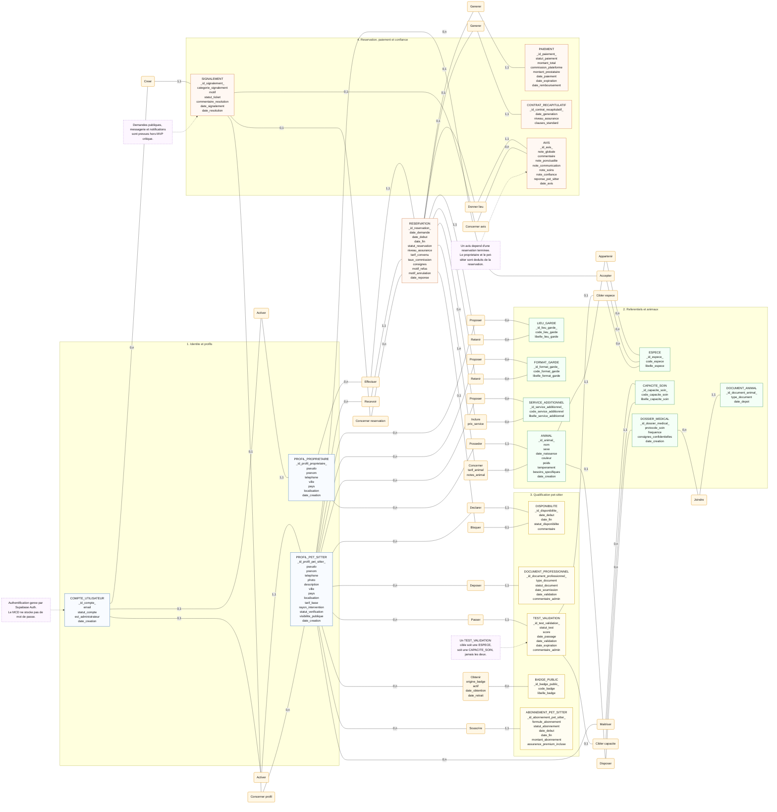

# MamiPet - MCD conceptuel Merise

Ce MCD est volontairement conceptuel :

- les entites portent les informations metier utiles ;
- les associations sont nommees avec des verbes ;
- les details techniques PostgreSQL, Supabase Storage et Stripe sont reserves au MPD ;
- les redondances evitables sont supprimees, notamment autour des avis.

## Decisions conceptuelles

1. `COMPTE_UTILISATEUR` represente le compte applicatif ; l'authentification est portee par Supabase Auth au niveau physique.
2. `PROFIL_PROPRIETAIRE` et `PROFIL_PET_SITTER` restent separes pour ne pas melanger l'identite du compte et les donnees metier.
3. `AVIS` depend uniquement de `RESERVATION` : le proprietaire auteur et le pet-sitter evalue sont deduits de la reservation.
4. `DISPONIBILITE` reste un creneau declare par un pet-sitter ; une reservation acceptee peut bloquer un creneau.
5. `SIGNALEMENT` peut viser une reservation, un profil pet-sitter ou un avis, sans imposer la messagerie complete dans le MVP.
