# MamiPet - MLD logique relationnel

## Conventions

- `PK` : cle primaire
- `FK` : cle etrangere
- `UQ` : unicite logique
- `NN` : non nul
- Les types sont logiques, pas des types PostgreSQL stricts.

## Schema relationnel de reference

```text
compte_utilisateur(
  id_compte PK,
  email UQ NN,
  statut_compte NN,
  est_administrateur NN,
  date_creation NN
)

profil_proprietaire(
  id_profil_proprietaire PK,
  id_compte FK UQ NN -> compte_utilisateur.id_compte,
  pseudo,
  prenom NN,
  telephone,
  adresse_ligne1,
  adresse_ligne2,
  code_postal,
  ville NN,
  pays NN,
  latitude,
  longitude,
  date_creation NN
)

profil_pet_sitter(
  id_profil_pet_sitter PK,
  id_compte FK UQ NN -> compte_utilisateur.id_compte,
  pseudo,
  prenom NN,
  telephone,
  photo_url,
  description,
  adresse_ligne1,
  adresse_ligne2,
  code_postal,
  ville NN,
  pays NN,
  latitude,
  longitude,
  tarif_base NN,
  rayon_km NN,
  statut_verification NN,
  visibilite_publique NN,
  date_creation NN
)

espece(id_espece PK, code_espece UQ NN, libelle_espece UQ NN)
capacite_soin(id_capacite_soin PK, code_capacite_soin UQ NN, libelle_capacite_soin UQ NN)
lieu_garde(id_lieu_garde PK, code_lieu_garde UQ NN, libelle_lieu_garde UQ NN)
format_garde(id_format_garde PK, code_format_garde UQ NN, libelle_format_garde UQ NN)
service_additionnel(id_service_additionnel PK, code_service_additionnel UQ NN, libelle_service_additionnel UQ NN)
badge_public(id_badge_public PK, code_badge_public UQ NN, libelle_badge_public UQ NN)

animal(
  id_animal PK,
  id_profil_proprietaire FK NN -> profil_proprietaire.id_profil_proprietaire,
  id_espece FK NN -> espece.id_espece,
  nom NN,
  sexe NN,
  date_naissance,
  couleur,
  poids_kg,
  temperament,
  besoins_specifiques,
  date_creation NN,
  UQ(id_animal, id_profil_proprietaire)
)

dossier_medical(
  id_dossier_medical PK,
  id_animal FK UQ NN -> animal.id_animal,
  protocole_soin,
  frequence,
  consignes_confidentielles,
  date_creation NN
)

document_animal(
  id_document_animal PK,
  id_dossier_medical FK NN -> dossier_medical.id_dossier_medical,
  type_document NN,
  nom_fichier,
  chemin_fichier,
  date_depot NN
)

profil_pet_sitter_espece(
  id_profil_pet_sitter PK FK -> profil_pet_sitter.id_profil_pet_sitter,
  id_espece PK FK -> espece.id_espece
)

profil_pet_sitter_capacite_soin(
  id_profil_pet_sitter PK FK -> profil_pet_sitter.id_profil_pet_sitter,
  id_capacite_soin PK FK -> capacite_soin.id_capacite_soin
)

profil_pet_sitter_lieu_garde(
  id_profil_pet_sitter PK FK -> profil_pet_sitter.id_profil_pet_sitter,
  id_lieu_garde PK FK -> lieu_garde.id_lieu_garde
)

profil_pet_sitter_format_garde(
  id_profil_pet_sitter PK FK -> profil_pet_sitter.id_profil_pet_sitter,
  id_format_garde PK FK -> format_garde.id_format_garde
)

profil_pet_sitter_service_additionnel(
  id_profil_pet_sitter PK FK -> profil_pet_sitter.id_profil_pet_sitter,
  id_service_additionnel PK FK -> service_additionnel.id_service_additionnel
)

disponibilite(
  id_disponibilite PK,
  id_profil_pet_sitter FK NN -> profil_pet_sitter.id_profil_pet_sitter,
  id_reservation FK UQ -> reservation.id_reservation,
  date_debut_disponibilite NN,
  date_fin_disponibilite NN,
  statut_disponibilite NN,
  commentaire
)

document_professionnel(
  id_document_professionnel PK,
  id_profil_pet_sitter FK NN -> profil_pet_sitter.id_profil_pet_sitter,
  type_document_professionnel NN,
  statut_document NN,
  nom_fichier,
  chemin_fichier,
  date_soumission NN,
  date_validation,
  commentaire_admin
)

test_validation(
  id_test_validation PK,
  id_profil_pet_sitter FK NN -> profil_pet_sitter.id_profil_pet_sitter,
  id_espece FK -> espece.id_espece,
  id_capacite_soin FK -> capacite_soin.id_capacite_soin,
  type_perimetre NN,
  statut_test NN,
  score,
  date_passage,
  date_validation,
  date_expiration,
  commentaire_admin
)

profil_pet_sitter_badge_public(
  id_profil_pet_sitter_badge_public PK,
  id_profil_pet_sitter FK NN -> profil_pet_sitter.id_profil_pet_sitter,
  id_badge_public FK NN -> badge_public.id_badge_public,
  origine_badge NN,
  actif NN,
  date_obtention NN,
  date_retrait
)

abonnement_pet_sitter(
  id_abonnement_pet_sitter PK,
  id_profil_pet_sitter FK NN -> profil_pet_sitter.id_profil_pet_sitter,
  formule_abonnement NN,
  statut_abonnement NN,
  date_debut_abonnement NN,
  date_fin_abonnement NN,
  assurance_premium_incluse NN,
  montant_abonnement,
  reference_paiement_externe
)

reservation(
  id_reservation PK,
  id_profil_proprietaire FK NN -> profil_proprietaire.id_profil_proprietaire,
  id_profil_pet_sitter FK NN -> profil_pet_sitter.id_profil_pet_sitter,
  id_lieu_garde FK NN -> lieu_garde.id_lieu_garde,
  id_format_garde FK NN -> format_garde.id_format_garde,
  date_demande NN,
  date_debut_reservation NN,
  date_fin_reservation NN,
  statut_reservation NN,
  niveau_assurance_applique NN,
  tarif_convenu NN,
  taux_commission_plateforme NN,
  consignes_reservation,
  motif_refus,
  motif_annulation,
  date_reponse,
  UQ(id_reservation, id_profil_proprietaire)
)

reservation_animal(
  id_reservation PK FK,
  id_animal PK FK,
  id_profil_proprietaire FK NN,
  tarif_animal NN,
  notes_animal_reservation,
  FK(id_reservation, id_profil_proprietaire) -> reservation(id_reservation, id_profil_proprietaire),
  FK(id_animal, id_profil_proprietaire) -> animal(id_animal, id_profil_proprietaire)
)

reservation_service_additionnel(
  id_reservation PK FK -> reservation.id_reservation,
  id_service_additionnel PK FK -> service_additionnel.id_service_additionnel,
  prix_service NN
)

paiement(
  id_paiement PK,
  id_reservation FK UQ NN -> reservation.id_reservation,
  statut_paiement NN,
  montant_total NN,
  commission_plateforme NN,
  montant_prestataire,
  reference_paiement_externe UQ,
  groupe_transfert_externe,
  date_paiement,
  date_expiration,
  date_remboursement
)

contrat_recapitulatif(
  id_contrat_recapitulatif PK,
  id_reservation FK UQ NN -> reservation.id_reservation,
  date_generation NN,
  niveau_assurance NN,
  clauses_standard NN,
  chemin_fichier,
  empreinte_document UQ
)

avis(
  id_avis PK,
  id_reservation FK UQ NN -> reservation.id_reservation,
  note_globale NN,
  commentaire,
  note_ponctualite,
  note_communication,
  note_soins,
  note_confiance,
  date_avis NN,
  reponse_pet_sitter,
  date_reponse_pet_sitter
)

signalement(
  id_signalement PK,
  id_compte_createur FK NN -> compte_utilisateur.id_compte,
  id_reservation FK -> reservation.id_reservation,
  id_profil_pet_sitter FK -> profil_pet_sitter.id_profil_pet_sitter,
  id_avis FK -> avis.id_avis,
  categorie_signalement NN,
  motif NN,
  statut_ticket NN,
  commentaire_resolution,
  date_signalement NN,
  date_resolution
)
```

## Diagramme Mermaid

```mermaid
erDiagram
    compte_utilisateur {
        UUID id_compte PK
        TEXTE email
        TEXTE statut_compte
        BOOLEEN est_administrateur
        DATETIME date_creation
    }

    profil_proprietaire {
        UUID id_profil_proprietaire PK
        UUID id_compte FK
        TEXTE pseudo
        TEXTE prenom
        TEXTE telephone
        TEXTE adresse_ligne1
        TEXTE adresse_ligne2
        TEXTE code_postal
        TEXTE ville
        TEXTE pays
        DECIMAL latitude
        DECIMAL longitude
        DATETIME date_creation
    }

    profil_pet_sitter {
        UUID id_profil_pet_sitter PK
        UUID id_compte FK
        TEXTE pseudo
        TEXTE prenom
        TEXTE telephone
        TEXTE photo_url
        TEXTE description
        TEXTE adresse_ligne1
        TEXTE adresse_ligne2
        TEXTE code_postal
        TEXTE ville
        TEXTE pays
        DECIMAL latitude
        DECIMAL longitude
        DECIMAL tarif_base
        ENTIER rayon_km
        TEXTE statut_verification
        BOOLEEN visibilite_publique
        DATETIME date_creation
    }

    espece {
        UUID id_espece PK
        TEXTE code_espece
        TEXTE libelle_espece
    }

    capacite_soin {
        UUID id_capacite_soin PK
        TEXTE code_capacite_soin
        TEXTE libelle_capacite_soin
    }

    lieu_garde {
        UUID id_lieu_garde PK
        TEXTE code_lieu_garde
        TEXTE libelle_lieu_garde
    }

    format_garde {
        UUID id_format_garde PK
        TEXTE code_format_garde
        TEXTE libelle_format_garde
    }

    service_additionnel {
        UUID id_service_additionnel PK
        TEXTE code_service_additionnel
        TEXTE libelle_service_additionnel
    }

    badge_public {
        UUID id_badge_public PK
        TEXTE code_badge_public
        TEXTE libelle_badge_public
    }

    animal {
        UUID id_animal PK
        UUID id_profil_proprietaire FK
        UUID id_espece FK
        TEXTE nom
        TEXTE sexe
        DATE date_naissance
        TEXTE couleur
        DECIMAL poids_kg
        TEXTE temperament
        TEXTE besoins_specifiques
        DATETIME date_creation
    }

    dossier_medical {
        UUID id_dossier_medical PK
        UUID id_animal FK
        TEXTE protocole_soin
        TEXTE frequence
        TEXTE consignes_confidentielles
        DATETIME date_creation
    }

    document_animal {
        UUID id_document_animal PK
        UUID id_dossier_medical FK
        TEXTE type_document
        TEXTE nom_fichier
        TEXTE chemin_fichier
        DATETIME date_depot
    }

    profil_pet_sitter_espece {
        UUID id_profil_pet_sitter PK, FK
        UUID id_espece PK, FK
    }

    profil_pet_sitter_capacite_soin {
        UUID id_profil_pet_sitter PK, FK
        UUID id_capacite_soin PK, FK
    }

    profil_pet_sitter_lieu_garde {
        UUID id_profil_pet_sitter PK, FK
        UUID id_lieu_garde PK, FK
    }

    profil_pet_sitter_format_garde {
        UUID id_profil_pet_sitter PK, FK
        UUID id_format_garde PK, FK
    }

    profil_pet_sitter_service_additionnel {
        UUID id_profil_pet_sitter PK, FK
        UUID id_service_additionnel PK, FK
    }

    disponibilite {
        UUID id_disponibilite PK
        UUID id_profil_pet_sitter FK
        UUID id_reservation FK
        DATETIME date_debut_disponibilite
        DATETIME date_fin_disponibilite
        TEXTE statut_disponibilite
        TEXTE commentaire
    }

    document_professionnel {
        UUID id_document_professionnel PK
        UUID id_profil_pet_sitter FK
        TEXTE type_document_professionnel
        TEXTE statut_document
        TEXTE nom_fichier
        TEXTE chemin_fichier
        DATETIME date_soumission
        DATETIME date_validation
        TEXTE commentaire_admin
    }

    test_validation {
        UUID id_test_validation PK
        UUID id_profil_pet_sitter FK
        UUID id_espece FK
        UUID id_capacite_soin FK
        TEXTE type_perimetre
        TEXTE statut_test
        DECIMAL score
        DATETIME date_passage
        DATETIME date_validation
        DATETIME date_expiration
        TEXTE commentaire_admin
    }

    profil_pet_sitter_badge_public {
        UUID id_profil_pet_sitter_badge_public PK
        UUID id_profil_pet_sitter FK
        UUID id_badge_public FK
        TEXTE origine_badge
        BOOLEEN actif
        DATETIME date_obtention
        DATETIME date_retrait
    }

    abonnement_pet_sitter {
        UUID id_abonnement_pet_sitter PK
        UUID id_profil_pet_sitter FK
        TEXTE formule_abonnement
        TEXTE statut_abonnement
        DATETIME date_debut_abonnement
        DATETIME date_fin_abonnement
        BOOLEEN assurance_premium_incluse
        DECIMAL montant_abonnement
        TEXTE reference_paiement_externe
    }

    reservation {
        UUID id_reservation PK
        UUID id_profil_proprietaire FK
        UUID id_profil_pet_sitter FK
        UUID id_lieu_garde FK
        UUID id_format_garde FK
        DATETIME date_demande
        DATETIME date_debut_reservation
        DATETIME date_fin_reservation
        TEXTE statut_reservation
        TEXTE niveau_assurance_applique
        DECIMAL tarif_convenu
        DECIMAL taux_commission_plateforme
        TEXTE consignes_reservation
        TEXTE motif_refus
        TEXTE motif_annulation
        DATETIME date_reponse
    }

    reservation_animal {
        UUID id_reservation PK, FK
        UUID id_animal PK, FK
        UUID id_profil_proprietaire FK
        DECIMAL tarif_animal
        TEXTE notes_animal_reservation
    }

    reservation_service_additionnel {
        UUID id_reservation PK, FK
        UUID id_service_additionnel PK, FK
        DECIMAL prix_service
    }

    paiement {
        UUID id_paiement PK
        UUID id_reservation FK
        TEXTE statut_paiement
        DECIMAL montant_total
        DECIMAL commission_plateforme
        DECIMAL montant_prestataire
        TEXTE reference_paiement_externe
        TEXTE groupe_transfert_externe
        DATETIME date_paiement
        DATETIME date_expiration
        DATETIME date_remboursement
    }

    contrat_recapitulatif {
        UUID id_contrat_recapitulatif PK
        UUID id_reservation FK
        DATETIME date_generation
        TEXTE niveau_assurance
        TEXTE clauses_standard
        TEXTE chemin_fichier
        TEXTE empreinte_document
    }

    avis {
        UUID id_avis PK
        UUID id_reservation FK
        ENTIER note_globale
        TEXTE commentaire
        ENTIER note_ponctualite
        ENTIER note_communication
        ENTIER note_soins
        ENTIER note_confiance
        DATETIME date_avis
        TEXTE reponse_pet_sitter
        DATETIME date_reponse_pet_sitter
    }

    signalement {
        UUID id_signalement PK
        UUID id_compte_createur FK
        UUID id_reservation FK
        UUID id_profil_pet_sitter FK
        UUID id_avis FK
        TEXTE categorie_signalement
        TEXTE motif
        TEXTE statut_ticket
        TEXTE commentaire_resolution
        DATETIME date_signalement
        DATETIME date_resolution
    }

    compte_utilisateur ||--o| profil_proprietaire : active
    compte_utilisateur ||--o| profil_pet_sitter : active
    profil_proprietaire ||--o{ animal : possede
    espece ||--o{ animal : classe
    animal ||--o| dossier_medical : possede
    dossier_medical ||--o{ document_animal : contient

    profil_pet_sitter ||--o{ profil_pet_sitter_espece : accepte
    espece ||--o{ profil_pet_sitter_espece : reference
    profil_pet_sitter ||--o{ profil_pet_sitter_capacite_soin : maitrise
    capacite_soin ||--o{ profil_pet_sitter_capacite_soin : reference
    profil_pet_sitter ||--o{ profil_pet_sitter_lieu_garde : propose
    lieu_garde ||--o{ profil_pet_sitter_lieu_garde : reference
    profil_pet_sitter ||--o{ profil_pet_sitter_format_garde : propose
    format_garde ||--o{ profil_pet_sitter_format_garde : reference
    profil_pet_sitter ||--o{ profil_pet_sitter_service_additionnel : propose
    service_additionnel ||--o{ profil_pet_sitter_service_additionnel : reference

    profil_pet_sitter ||--o{ disponibilite : declare
    reservation o|--o| disponibilite : bloque
    profil_pet_sitter ||--o{ document_professionnel : depose
    profil_pet_sitter ||--o{ test_validation : passe
    espece ||--o{ test_validation : cible
    capacite_soin ||--o{ test_validation : cible
    profil_pet_sitter ||--o{ profil_pet_sitter_badge_public : obtient
    badge_public ||--o{ profil_pet_sitter_badge_public : reference
    profil_pet_sitter ||--o{ abonnement_pet_sitter : souscrit

    profil_proprietaire ||--o{ reservation : effectue
    profil_pet_sitter ||--o{ reservation : recoit
    lieu_garde ||--o{ reservation : retient
    format_garde ||--o{ reservation : retient
    reservation ||--|{ reservation_animal : concerne
    animal ||--o{ reservation_animal : est_concerne
    reservation ||--o{ reservation_service_additionnel : inclut
    service_additionnel ||--o{ reservation_service_additionnel : est_inclus
    reservation ||--o| paiement : genere
    reservation ||--o| contrat_recapitulatif : genere
    reservation ||--o| avis : donne_lieu
    compte_utilisateur ||--o{ signalement : cree
    reservation ||--o{ signalement : peut_concerner
    profil_pet_sitter ||--o{ signalement : peut_concerner
    avis ||--o{ signalement : peut_concerner
```



## Contraintes logiques importantes

1. Un compte peut activer au plus un profil proprietaire et au plus un profil pet-sitter.
2. Un avis est unique par reservation ; son auteur et son destinataire sont deduits de la reservation.
3. Une reservation doit concerner au moins un animal du proprietaire qui l'a creee.
4. `test_validation` porte une contrainte XOR sur son perimetre : espece ou capacite de soin.
5. Un pet-sitter ne peut avoir qu'un abonnement actif ou en essai a la fois.
6. Un badge public actif ne peut apparaitre qu'une fois par profil pet-sitter.
7. Un signalement cible au plus une reservation, un profil pet-sitter ou un avis.
