# MamiPet - MPD PostgreSQL / Supabase

Ce MPD est la version physique cible pour PostgreSQL/Supabase. Il conserve le modele relationnel du MLD, puis ajoute les choix techniques necessaires :

- `uuid` pour les identifiants ;
- integration Supabase Auth via `compte_utilisateur.id_compte -> auth.users.id` ;
- contraintes `CHECK` sur les statuts, dates, montants et notes ;
- index techniques sur les FK et les parcours de recherche ;
- details Stripe et stockage fichier uniquement au niveau physique.

```mermaid
erDiagram
    compte_utilisateur {
        uuid id_compte PK
        text email
        text statut_compte
        boolean est_administrateur
        timestamptz date_creation
    }

    profil_proprietaire {
        uuid id_profil_proprietaire PK
        uuid id_compte FK
        text pseudo
        text prenom
        text telephone
        text adresse_ligne1
        text adresse_ligne2
        text code_postal
        text ville
        text pays
        numeric latitude
        numeric longitude
        timestamptz date_creation
    }

    profil_pet_sitter {
        uuid id_profil_pet_sitter PK
        uuid id_compte FK
        text pseudo
        text prenom
        text telephone
        text photo_url
        text description
        text adresse_ligne1
        text adresse_ligne2
        text code_postal
        text ville
        text pays
        numeric latitude
        numeric longitude
        numeric tarif_base
        integer rayon_km
        text statut_verification
        boolean visibilite_publique
        timestamptz date_creation
    }

    espece {
        uuid id_espece PK
        text code_espece
        text libelle_espece
    }

    capacite_soin {
        uuid id_capacite_soin PK
        text code_capacite_soin
        text libelle_capacite_soin
    }

    lieu_garde {
        uuid id_lieu_garde PK
        text code_lieu_garde
        text libelle_lieu_garde
    }

    format_garde {
        uuid id_format_garde PK
        text code_format_garde
        text libelle_format_garde
    }

    service_additionnel {
        uuid id_service_additionnel PK
        text code_service_additionnel
        text libelle_service_additionnel
    }

    animal {
        uuid id_animal PK
        uuid id_profil_proprietaire FK
        uuid id_espece FK
        text nom
        text sexe
        date date_naissance
        text couleur
        numeric poids_kg
        text temperament
        text besoins_specifiques
        timestamptz date_creation
    }

    dossier_medical {
        uuid id_dossier_medical PK
        uuid id_animal FK
        text protocole_soin
        text frequence
        text consignes_confidentielles
        timestamptz date_creation
    }

    document_animal {
        uuid id_document_animal PK
        uuid id_dossier_medical FK
        text type_document
        text nom_fichier
        text chemin_fichier
        timestamptz date_depot
    }

    badge_public {
        uuid id_badge_public PK
        text code_badge_public
        text libelle_badge_public
    }

    profil_pet_sitter_espece {
        uuid id_profil_pet_sitter PK, FK
        uuid id_espece PK, FK
    }

    profil_pet_sitter_capacite_soin {
        uuid id_profil_pet_sitter PK, FK
        uuid id_capacite_soin PK, FK
    }

    profil_pet_sitter_lieu_garde {
        uuid id_profil_pet_sitter PK, FK
        uuid id_lieu_garde PK, FK
    }

    profil_pet_sitter_format_garde {
        uuid id_profil_pet_sitter PK, FK
        uuid id_format_garde PK, FK
    }

    profil_pet_sitter_service_additionnel {
        uuid id_profil_pet_sitter PK, FK
        uuid id_service_additionnel PK, FK
    }

    disponibilite {
        uuid id_disponibilite PK
        uuid id_profil_pet_sitter FK
        uuid id_reservation FK
        timestamptz date_debut_disponibilite
        timestamptz date_fin_disponibilite
        text statut_disponibilite
        text commentaire
    }

    document_professionnel {
        uuid id_document_professionnel PK
        uuid id_profil_pet_sitter FK
        text type_document_professionnel
        text statut_document
        text nom_fichier
        text chemin_fichier
        timestamptz date_soumission
        timestamptz date_validation
        text commentaire_admin
    }

    test_validation {
        uuid id_test_validation PK
        uuid id_profil_pet_sitter FK
        uuid id_espece FK
        uuid id_capacite_soin FK
        text type_perimetre
        text statut_test
        numeric score
        timestamptz date_passage
        timestamptz date_validation
        timestamptz date_expiration
        text commentaire_admin
    }

    profil_pet_sitter_badge_public {
        uuid id_profil_pet_sitter_badge_public PK
        uuid id_profil_pet_sitter FK
        uuid id_badge_public FK
        text origine_badge
        boolean actif
        timestamptz date_obtention
        timestamptz date_retrait
    }

    abonnement_pet_sitter {
        uuid id_abonnement_pet_sitter PK
        uuid id_profil_pet_sitter FK
        text formule_abonnement
        text statut_abonnement
        timestamptz date_debut_abonnement
        timestamptz date_fin_abonnement
        boolean assurance_premium_incluse
        numeric montant_abonnement
        text reference_paiement_externe
    }

    reservation {
        uuid id_reservation PK
        uuid id_profil_proprietaire FK
        uuid id_profil_pet_sitter FK
        uuid id_lieu_garde FK
        uuid id_format_garde FK
        timestamptz date_demande
        timestamptz date_debut_reservation
        timestamptz date_fin_reservation
        text statut_reservation
        text niveau_assurance_applique
        numeric tarif_convenu
        numeric taux_commission_plateforme
        text consignes_reservation
        text motif_refus
        text motif_annulation
        timestamptz date_reponse
    }

    reservation_animal {
        uuid id_reservation PK, FK
        uuid id_animal PK, FK
        uuid id_profil_proprietaire FK
        numeric tarif_animal
        text notes_animal_reservation
    }

    reservation_service_additionnel {
        uuid id_reservation PK, FK
        uuid id_service_additionnel PK, FK
        numeric prix_service
    }

    paiement {
        uuid id_paiement PK
        uuid id_reservation FK
        text statut_paiement
        numeric montant_total
        numeric commission_plateforme
        numeric montant_prestataire
        text stripe_payment_intent_id
        text stripe_transfer_group
        timestamptz date_paiement
        timestamptz date_expiration
        timestamptz date_remboursement
    }

    contrat_recapitulatif {
        uuid id_contrat_recapitulatif PK
        uuid id_reservation FK
        timestamptz date_generation
        text niveau_assurance
        text clauses_standard
        text chemin_fichier
        text hash_document
    }

    avis {
        uuid id_avis PK
        uuid id_reservation FK
        smallint note_globale
        text commentaire
        smallint note_ponctualite
        smallint note_communication
        smallint note_soins
        smallint note_confiance
        timestamptz date_avis
        text reponse_pet_sitter
        timestamptz date_reponse_pet_sitter
    }

    signalement {
        uuid id_signalement PK
        uuid id_compte_createur FK
        uuid id_reservation FK
        uuid id_profil_pet_sitter FK
        uuid id_avis FK
        text categorie_signalement
        text motif
        text statut_ticket
        text commentaire_resolution
        timestamptz date_signalement
        timestamptz date_resolution
    }

    compte_utilisateur ||--o| profil_proprietaire : active
    compte_utilisateur ||--o| profil_pet_sitter : active
    profil_proprietaire ||--o{ animal : possede
    espece ||--o{ animal : classe
    animal ||--o| dossier_medical : possede
    dossier_medical ||--o{ document_animal : contient

    profil_pet_sitter ||--o{ profil_pet_sitter_espece : accepte
    espece ||--o{ profil_pet_sitter_espece : reference
    profil_pet_sitter ||--o{ profil_pet_sitter_capacite_soin : maitrise
    capacite_soin ||--o{ profil_pet_sitter_capacite_soin : reference
    profil_pet_sitter ||--o{ profil_pet_sitter_lieu_garde : propose
    lieu_garde ||--o{ profil_pet_sitter_lieu_garde : reference
    profil_pet_sitter ||--o{ profil_pet_sitter_format_garde : propose
    format_garde ||--o{ profil_pet_sitter_format_garde : reference
    profil_pet_sitter ||--o{ profil_pet_sitter_service_additionnel : propose
    service_additionnel ||--o{ profil_pet_sitter_service_additionnel : reference

    profil_pet_sitter ||--o{ disponibilite : declare
    reservation o|--o| disponibilite : bloque
    profil_pet_sitter ||--o{ document_professionnel : depose
    profil_pet_sitter ||--o{ test_validation : passe
    espece ||--o{ test_validation : cible
    capacite_soin ||--o{ test_validation : cible
    profil_pet_sitter ||--o{ profil_pet_sitter_badge_public : obtient
    badge_public ||--o{ profil_pet_sitter_badge_public : reference
    profil_pet_sitter ||--o{ abonnement_pet_sitter : souscrit

    profil_proprietaire ||--o{ reservation : effectue
    profil_pet_sitter ||--o{ reservation : recoit
    lieu_garde ||--o{ reservation : retient
    format_garde ||--o{ reservation : retient
    reservation ||--|{ reservation_animal : concerne
    animal ||--o{ reservation_animal : est_concerne
    reservation ||--o{ reservation_service_additionnel : inclut
    service_additionnel ||--o{ reservation_service_additionnel : est_inclus
    reservation ||--o| paiement : genere
    reservation ||--o| contrat_recapitulatif : genere
    reservation ||--o| avis : donne_lieu
    compte_utilisateur ||--o{ signalement : cree
    reservation ||--o{ signalement : peut_concerner
    profil_pet_sitter ||--o{ signalement : peut_concerner
    avis ||--o{ signalement : peut_concerner
```

## Contraintes physiques majeures

1. `compte_utilisateur.id_compte` reference `auth.users(id)` ; aucun hash de mot de passe n'est stocke dans le schema applicatif.
2. `profil_proprietaire.id_compte` et `profil_pet_sitter.id_compte` sont uniques : un compte active au plus un profil de chaque type.
3. Les coordonnees respectent les bornes geographiques : latitude `[-90, 90]`, longitude `[-180, 180]`.
4. `test_validation` impose une contrainte XOR controlee par `type_perimetre`.
5. `reservation_animal` utilise deux FK composites pour garantir que les animaux appartiennent au proprietaire de la reservation.
6. `paiement.montant_prestataire` est genere : `montant_total - commission_plateforme`.
7. `avis.id_reservation` est unique : un seul avis par reservation terminee.
8. `profil_pet_sitter_badge_public` porte un index unique partiel sur les badges actifs.
9. `abonnement_pet_sitter` porte un index unique partiel sur les abonnements actifs ou en essai.
10. `signalement` accepte au plus une cible directe parmi reservation, profil pet-sitter et avis.

## Index recommandes

- FK principales : profils, animaux, reservations, paiements, signalements.
- Recherche pet-sitter : `(statut_verification, visibilite_publique)`, `(ville, code_postal)`, puis PostGIS en evolution si la recherche par rayon devient centrale.
- Disponibilites : `(id_profil_pet_sitter, date_debut_disponibilite, date_fin_disponibilite)`.
- Reservations : `(id_profil_proprietaire, statut_reservation)`, `(id_profil_pet_sitter, statut_reservation)`, `(date_debut_reservation, date_fin_reservation)`.
- Administration : documents par statut, paiements par statut, signalements par statut.
